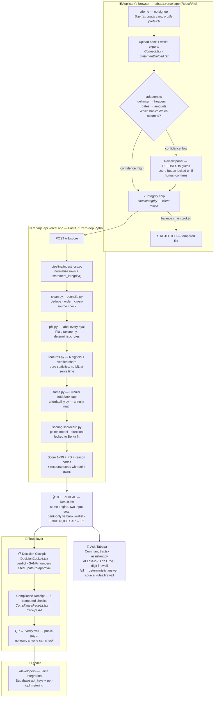
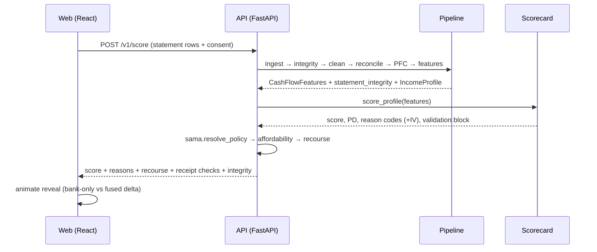
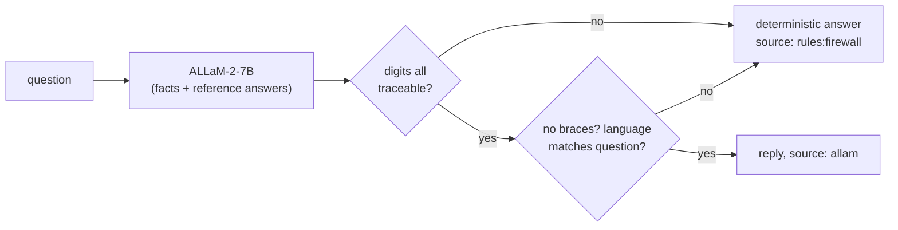

# Tabaqa MVP — the deep map + the story

> Internal explainer for the team. Untracked, docs-freeze safe.
> One sentence: **banks score what they can see; Tabaqa scores what people actually earn — then proves the decision to anyone with a QR code.**
>
> How to read this: §1 is the bird's-eye diagram. §2 walks every stage three ways — *baby version* (say it to anyone), *what actually happens* (the mechanism), *the algorithm* (real thresholds, real file). §3 is the tech inventory. §4 is the pitch story. §5 is Q&A ammunition. §6 is what we honestly do NOT claim — read it before any judge does.

---

## 1 · The bird's-eye flow

And the request path as a sequence — what happens in the ~1 second after "Reveal":

---

## 2 · Every stage, in depth

### ① Entry — the judge is inside before they decide to be

**Baby:** the shop has no door — you're already inside, and a friendly card walks you around.
**What happens:** `/demo` needs no email or password. `Tour.tsx` renders a coach card that *drives the app itself* (navigates screens rather than pointing spotlights at them — no fragile DOM anchors to break). It auto-opens once per browser.
**The engineering detail that matters:** Vercel serverless functions cold-start (10–30 s worst case — once timed out an entire judge entry). Fix: `Connect.tsx` prefetches the demo profile *on mount*, so the cold start burns while the judge is still reading the first screen. Measured: entry 4.1 s, persona 1.4 s, sample upload 0.9 s machine time — the whole new-applicant path ≪ 60 s.
**Why built this way:** a judge who has to sign up is a judge who left. A demo that flickers "loading…" for 20 seconds is a demo that reads broken.

### ② Universal ingestion — eat any statement (`web/src/lib/adapters.ts`, 494 lines)

**Baby:** the machine eats any cereal box — Arabic or English, any brand — and always finds the cereal. And when it isn't sure, it *asks* instead of guessing.
**What happens, step by step:**
1. **Delimiter detection** (`detectDelimiter`): counts `,` `;` `\t` occurrences *outside quoted strings* across lines — the winner is the delimiter. Handles Arabic exports that quote descriptions containing commas.
2. **Header matching** (`matchHeaderCells`): each column header is tested against bilingual synonym maps to canonical fields (date/description/amount/debit/credit/balance/source). "التاريخ", "Date", "تاريخ العملية" → `date`. Works for Alinma, urpay, D360, and generic exports via institution fingerprints (`institutions.ts`).
3. **Date parsing** (`parseDateCell` + `hijriToGregorian`): recognizes Gregorian formats AND Hijri dates, converting Hijri arithmetically (tabular Islamic calendar) — a wallet export dated ١٤٤٧/٠١/١٥ lands on the right Gregorian day.
4. **Amount parsing** (`parseAmountCell` + `toAsciiDigits`): Arabic-Indic digits (٠-٩, ۰-۹), Arabic decimal/thousands marks (٫ ٬), parenthesized negatives, and debit/credit two-column conventions all normalize to one signed number.
5. **Confidence grading** — the part that makes it trustworthy. After mapping, the adapter grades *itself* and flags `confidence: 'low'` with named reasons (adapters.ts:451-455):
   - `header` — header row matched fewer than 2 canonical fields;
   - `description` — no description column found;
   - `skipped` — more than 30% of rows failed to parse;
   - `direction` — every amount is positive (direction convention unclear).
   Any reason → `StatementUpload.tsx` opens a review panel (mapping chips + row preview) and **locks the score button** until the human clicks "الأعمدة صحيحة — تابع".
**Why built this way:** a silently mis-parsed statement produces a confidently wrong score — the worst possible failure for a credit product. Refusing to guess *is* the feature. (The curated demo samples are verified to pass ungated.)

### ③ The tamper trap — `statement_integrity()` (`pipeline/ingest_csv.py:203`)

**Baby:** a real statement is a LEGO tower — every brick sits on the one below (balance + transaction = next balance). Pull one brick from the middle and everything above it falls. We check every brick.
**The algorithm, exactly:**
- Group balance-bearing rows per `source` (each account is its own chain).
- For each consecutive pair, test `balance[i] == balance[i-1] + signed_amount[i]` within **±0.011** (one halala of float tolerance).
- Statements come oldest-first or newest-first — so the chain is tested in **both directions** and the better direction counts (a genuine file is perfect one way; direction ambiguity never fails an honest file).
- Handles both amount conventions: a single signed column, or debit/credit twin columns (credit = +, debit = −).
- **Strict: one broken pair = failed.** Returns `{checked, passed, pairs, breaks}`; returns `None` (honestly "not checkable") when fewer than 2 consecutive balance-bearing pairs exist — we never claim a check we couldn't run.
- The exact logic is mirrored client-side (`checkIntegrity` in adapters.ts) so the ✓/✗ chip appears the instant a file is dropped, before any network call. The server result becomes the **6th computed check** on the Compliance Receipt.
**The demo beat:** paste a genuine CSV → ✓. Open it in Excel, change one amount by one riyal, re-upload → ✗ "سلسلة الرصيد غير مُطابقة". Ten seconds, no slides.
**Honest scope (know this for Q&A):** it proves *internal arithmetic consistency* — it defeats casual Excel edits, not a forger who recomputes every downstream balance. The full answer to forgery is source-verified data via Open Banking AIS (the deployment mode), where the statement comes from the bank, not the applicant. Say both halves.

### ④ Label every riyal — `pipeline/pfc.py`

**Baby:** sorting the toy box — cars here, blocks there. Salary, rent, BNPL installment, groceries, each riyal gets a name tag.
**What happens:** deterministic keyword/pattern rules map each transaction to Plaid's Personal Finance Category taxonomy (the de-facto industry standard), adapted to Saudi merchants (`merchants.ts` carries the logo map the UI shows). Each label carries a confidence level (`confidence_level`). Internal transfers between the applicant's own accounts are tagged `TYPE_INTERNAL` so moving your own money between bank and wallet never counts as income or spending.
**Why deterministic and not an LLM:** the money path must replay identically in an audit. The LLM (`enrich.py`) only decorates the *long tail* of merchant names for display — it can never change a category that feeds the score.

### ⑤ Six signals — `pipeline/features.py` (pure stdlib `statistics`)

**Baby:** we don't count your toys — we watch how you play. Does pocket money arrive every week? Do you spend it all? Do you ever go below zero?

The exact formulas the score reads:

| Signal | Formula | Meaning |
|---|---|---|
| `income_regularity` | `clamp(1 − CV(monthly income)) × coverage` where coverage = months-with-income ÷ months observed | 1.0 = same amount, every month. Sporadic or missing months decay it toward 0 |
| `income_expense_ratio` | mean monthly income ÷ mean monthly expense (internal transfers excluded; no expenses → treated as 99) | > 1 means saving |
| `nsf_count` | rebuild the event-by-event running balance of *every* account from its opening balance; count events below zero | overdraft moments, reconstructed — not read from a flag |
| `min_balance`, `avg_balance` | min/mean of the bank account's running-balance series | the buffer |
| `balance_volatility` | coefficient of variation of the balance series | calm vs chaotic account |
| `recurring_obligation_load` | mean monthly `TYPE_OBLIGATION` outflow ÷ mean monthly income | the cash-flow DBR |
| `verified_income_share` | share of income Masdr-verified (amount or source) | **the wallet-reveal signal** — this is where fusing the wallet moves the score |

**Why these six:** they are the cash-flow underwriting signals the literature validates (FinRegLab, BIS 0.76-vs-0.64), they compute from *any* statement in stdlib Python (zero-dependency demo), and each one is explainable to an applicant in one sentence.

### ⑥ The scorecard — `scoring/scorecard.py`

**Baby:** a board game with the rules printed on the box. Every behavior earns or loses printed points. Same play, same score, every time — no referee moods.
**The mechanism:** additive points model — the exact shape `optbinning.Scorecard` produces, kept dependency-free. Start at **base 20**, then first-matching-bin per signal:

| Signal | Bins → points |
|---|---|
| Income regularity | ≥0.8 → **+18** · ≥0.6 → +12 · ≥0.4 → +6 · else **−6** |
| Verified income share | ≥0.7 → **+14** · ≥0.4 → +8 · else 0 |
| NSF events | 0 → **+12** · ≤2 → +3 · else **−12** |
| Income/expense ratio | ≥1.4 → +8 · ≥1.15 → +5 · ≥1.0 → +1 · else −8 |
| Min balance | ≥1000 → +6 · ≥0 → +2 · negative → −8 |
| Balance volatility | ≤0.4 → +4 · ≤0.8 → +1 · else −4 |
| Obligation load | ≤0.3 → 0 · ≤0.5 → −5 · else **−12** |

Sum → clamp to **1–99**. Then `PD = clamp(1.39 × (1 − score/99)², 0.002–0.99)` and risk flag: PD < 6% low · < 15% medium · else high. Reason codes = contributions ranked by |points|, top-3 as the API headline — each carrying its **Information Value from the real-data fit**, so every reason arrives with its evidence.
**The direction lock — our anti-drift safeguard (`_verify_lineage`, runs at import):** `scoring/train.py` fits the same six features on real Berka default outcomes (6-feature fit: holdout AUC 0.890, 5-fold CV 0.858; the headline full-model CV AUC 0.864 lives in the model card) and writes `model_params.json`. At import, the served card is machine-checked: **any weight pointing against the fitted direction crashes the app** rather than serving a contradiction. One documented monotonic override exists (`income_expense_ratio`, mirroring optbinning's `monotonic_trend`); `verified_income_share` is expert-set (Berka has no wallet analogue — disclosed, not hidden).
**What this buys in one sentence:** more verified income can *never* lower your score, and if a code change ever made it so, the server would refuse to boot.

### ⑦ Recourse — the score turned toward the applicant

**Baby:** the game doesn't just say "you lose" — it says "collect two more coins and roll again, and here is exactly how many points that's worth."
**What happens:** for a below-target profile the engine simulates feature improvements against the same bins and emits `recourse.steps` — each step = a human action (from the fixed bilingual `_RECOURSE_ACTION` map: "وثّق المزيد من الدخل", "تجنّب السحب على المكشوف"…) + its exact point `gain` + a `projected_score`. Guardrail: recourse only ever suggests actions that map to real features — no "get a better job" platitudes. Already-prime profiles (Fahd at 82) say so honestly: `already_prime: true`, no invented steps.
**Why it's the product's soul:** every incumbent scores people *for the lender*. The inversion — same math, faced toward the applicant, with a path — is the innovation criterion in one screen (`RecoursePanel.tsx`).

### ⑧ SAMA + affordability — `sama.py` · `affordability.py`

**Baby:** the referee's rulebook, with the page number printed on the screen.
**What happens:** `resolve_policy()` applies SAMA's *Responsible Lending Principles* (Circular 46538/99, Chapter IV — cited in the UI): binding salary-deduction cap **33.33%** of gross for employees / **25%** for retirees, plus the segment's total-obligations ceiling (**45%** default · **55%** income ≤ 15k · **65%** for 15–25k or REDF beneficiaries). `affordability.py` then does the annuity math: max installment = cap × income − existing obligations → `annuity_factor(i, n)` → maximum principal at a given rate/tenor → the decision.
**Why it matters:** affordability isn't our opinion — it's the regulator's own numbers, computed live and cited. This is the "deploys inside a licensee tomorrow" argument made executable.

### ⑨ THE REVEAL — the demo's heart (`Result.tsx`)

**Baby:** the teacher graded half your homework and gave you a C. We show the other half — and the grade was an A all along.
**What happens mechanically:** the same engine runs on two input sets — bank-only, then bank+wallet fused. Nothing else differs, so the delta *is* the wallet layer, honest by construction. For Fahd (`con_8842`): the wallet reveals **+6,000 SAR/month** of real, Masdr-verified income invisible to the bank statement → `verified_income_share` jumps → **score 82**. The animation plays that delta as a story beat.
**Choreography note (from the Jul 10 session):** Fahd is *already prime* — his beat is "look what lifted it." For a decline→approval arc, use a persona or an own-data upload.

### ⑩ Ask-Tabaqa — the firewalled copilot (`assistant.py` + `CommandBar.tsx`)

**Baby:** a friend who read your report card and explains it in your language — but is physically unable to say any number that isn't written on the card.
**The stack:** ALLaM-2-7B (the Saudi national model) served by Groq, temperature 0.35, fed `copilotFacts` — score, reveal amount, reason codes, recourse steps, SAMA caps — as `context.facts`. The system prompt embeds **pre-translated reference answers** (Arabic + English, every number engine-verified): a 7B model *rephrases* well but *composes* badly, so we let it rephrase a correct answer instead of composing a wrong one. That pattern is what made quality land.
**The firewall — every reply must pass all gates or it never reaches the screen:**
1. **Digit grounding** (`_reply_grounded`): normalize Arabic-Indic and Eastern digits + Arabic decimal marks (`str.maketrans("٠١٢٣٤٥٦٧٨٩۰۱۲۳۴۵۶۷۸۹٫٬", …)`), extract every number, and require each to trace to the allowed set — every fact number, its rounding, its percent form (0.55 may be spoken as 55%), plus harmless counts 0–12 and the scale constants 99/100. Tolerance: ±0.011 absolute or 0.5% relative. One untraceable number → rejected.
2. **Template hygiene** (`_reply_clean`): any leaked `{` or `}` → rejected.
3. **Language integrity:** an Arabic question must get a *pure Arabic* reply — more than 2 Latin words outside the brand allowlist (tabaqa, sama, nsf, sar, urpay, barq, masdr, allam…) → rejected. English questions symmetrically (< 30% Arabic characters).
4. **Rejection is silent:** the user sees `_grounded_answer()` — the deterministic recourse answer built from the same facts — tagged `source: rules:firewall`. The same answer serves Groq 429s and missing keys. The AI degrades to rules; it never degrades to nonsense.

**The one-liner for judges:** *the AI narrates; the rules decide — and the narrator is caged by the arithmetic.*
**Ops truth:** Groq free tier counts *requested* max_tokens against 6k tokens/min — the copilot's ~2k-token prompt allows ~2 calls/min before 429→fallback. Dev Tier before Jul 16 is what keeps the live-AI factor live.

### ⑪ The receipt — `ComplianceReceipt.tsx` → `/receipt` → `/verify`

**Baby:** the toy comes with a certificate, and anyone can scan the sticker to check it's real — no account, no password.
**What happens:** every decision emits **six checks computed live from this decision's own data** (never static ✓s): DBR under the cited SAMA cap · consent recorded · verification tier honesty · data-processor route · income evidence · **statement integrity (stage ③'s result)**. Rendered in-app, printed as an A4 artifact at `/receipt`, verified publicly at `/verify?rc=` via QR. The `/report` page is the applicant-facing sibling — an Arabic-first, Naskh-set attestation.
**Why:** the compliance officer is a buyer too. A filable artifact turns "trust us" into "file this."

### ⑫ The lender surface — cockpit + API

**Baby:** one plug that fits every lamp — five lines of code and the lender's system asks us for scores.
**What happens:** `DecisionCockpit.tsx` composes the memo a credit officer would file: verdict banner, mini gauge, SAMA numbers with citation, signed reasons with feature values. The API side: Supabase `api_keys` table + per-call metering behind one auth core (stdlib PostgREST calls, **fail-open** so a Supabase blip can never take the demo down), live sandbox keys issued from `/developers`, hosted reference at `API_REFERENCE.md`. Integration is genuinely 5 lines against `POST /v1/score`.

### ⑬ The evidence layer — why any of this is believable (`eval/`, frozen ❄️)

**Baby:** we didn't just build the toy — we tested it on nearly a million real children's report cards, and we even ran the one experiment that could prove us wrong. It didn't.
**AUC in one breath:** put one good payer and one defaulter behind a curtain and ask the model to point at the riskier one — AUC is how often it points right. 0.5 = coin flip, 1.0 = always.
**The three-population ladder (each answers a different question):**
1. **Berka (Czech, real defaults) — the mechanism.** Bureau-style view vs +cash-flow ablation: **+0.203 AUC** (CI +0.14…+0.27); thin-file applicants 0.60→0.78; wrong-side-of-cutoff swap set 7.6%→2.9%. Two *independent* data sources fused — the exact shape of bank+wallet.
2. **UCI Taiwan — the negative control, published against ourselves.** Same recipe on *single-source* data: **zero lift**. This is falsification, not marketing: the lift needs a second independent source to exist — which is precisely our thesis.
3. **AlfaBattle 2.0 — scale.** **963,811 real applications, 26,577 defaults**: lift **+0.117** (CI +0.112…+0.121). The mechanism survives contact with a million rows.
Plus: 1M-account Gaussian-copula synthetic corpus with **TSTR 96%** (train-on-synthetic-test-on-real retains 96% of real-data AUC — the anti-circularity proof), and a Saudi prior anchor (×0.819 attenuation from GASTAT/GOSI/Findex deciles) so no Czech magnitude is ever quoted as Saudi truth.
**The honesty layered in:** magnitudes re-fit on the licensee's own book at deployment; only *directions* are claimed as transferable — and the direction lock (§⑥) enforces exactly that claim in code.

---

## 3 · Tech inventory — what, where, why this and not that

| Tech | Where | What it does | Why this over the alternative |
|---|---|---|---|
| React + Vite + TS | `web/` | the app | instant HMR, static deploy on Vercel |
| Bilingual RTL + Hijri | `dates.ts`, all components | Arabic-first UX | judges are Saudi; RTL bolted-on always shows |
| CSV adapters | `adapters.ts` | any bank/wallet export | vs "upload our template" — real exports or nothing |
| Integrity chain | `ingest_csv.py` + `adapters.ts` | tamper refusal | computed proof beats a "verified ✓" sticker |
| FastAPI + pure-stdlib pipeline | `api/`, `pipeline/` | serve scores anywhere | zero deps = runs on a judge's laptop offline (`smoke_test.py`) |
| Plaid PFC taxonomy | `pfc.py` | categorize riyals | industry-standard labels vs homemade ontology |
| WOE points scorecard | `scoring/` | the decision | auditable & replayable; a GBM/LLM scorer is neither |
| Direction lock | `scorecard.py:_verify_lineage` | anti-drift | the served card can't contradict the validated fit — enforced at boot |
| SAMA policy module | `sama.py` | cited caps | the regulator's numbers, not ours |
| ALLaM-2-7B @ Groq | `assistant.py`, `enrich.py` | AR/EN narration | the *Saudi national model* — optics and substance; Groq = fastest inference |
| Digit firewall | `assistant.py` | cage the narrator | grounding enforced by arithmetic, not by prompt-hoping |
| Supabase | `api/keystore.py`, `auth.py` | keys + metering | managed Postgres, RLS, minutes to live keys |
| Vercel (web + API) | both projects | hosting | judge-openable URL; cold start absorbed by prefetch |
| eval harness | `eval/` | the proof | ablation, negative control, TSTR — teams claim, we measure |

---

## 4 · The story — Watheeq's formula, our ammunition

Watheeq's thread structure (what demonstrably hooked 238k viewers): **known pain → "الفكرة ببساطة" one-liner → the object transforms → each tech in one breath → a folk anchor → anyone-can-verify → the vision sentence.** Ours, beat for beat — with delivery notes:

**1 · The pain.** كم سعودي راتبه يجي على STC Pay أو urpay والبنك يشوفه "بدون دخل"؟ Millions earn in wallets the credit system can't see. The bank doesn't say "no" — it says *invisible*. *(screen: the bank-only thin file)*

**2 · الفكرة ببساطة.** درجة ائتمانية تشوف دخلك الحقيقي — وموجهة **لك** أنت، مو بس للبنك. A score built from how money actually moves, turned to face the applicant. *(pause here — this is the thesis)*

**3 · The transformation.** A dead CSV becomes an auditable decision: every riyal labeled, six behaviors measured, points from a printed table — قابلة للتدقيق، سطر بسطر. *(screen: reason codes with point values)*

**4 · The AI, one breath.** نستخدم **علّام** — النموذج السعودي — يشرح درجتك بالعربي، وخلف جدار ناري حسابي: أي رقم مو من ملفك، الرد ينرفض قبل ما يوصلك. *The AI narrates; the rules decide.* *(screen: ask "ليش درجتي ٨٢؟" live)*

**5 · The folk anchor** (theirs: "قد لقيت أحد زوّر بيتكوين؟" — ours): **"عدّل ريال واحد في الكشف — والإيصال يرفضك."** *(do it live: edit one riyal, re-upload, red ✗ — ten seconds)*

**6 · Anyone can verify.** كل قرار يطلع معه إيصال امتثال — ستة فحوصات محسوبة، QR، صفحة عامة، بدون تسجيل. The decision carries its own proof. *(screen: scan the QR with a phone)*

**7 · The receipts.** Three real populations. **963,811** real applications. And a negative control we published **against ourselves** — the experiment that could have killed the idea, run by us, disclosed by us. هذا مو رأينا — هذا قياس. *(one number per breath)*

**8 · Who it's for.** البنوك، التمويل الأصغر، الـ BNPL — read-only على الموافقة، داخل المُرخّص نفسه، بدون ترخيص جديد. Deploys at Alinma tomorrow.

**9 · The vision sentence.** Watheeq closed with *"هدفنا بناء **طبقة** ثقة رقمية"* — a digital trust **layer**. That word is our name. **طبقة** — الطبقة المالية الي تخلي الدخل غير المرئي مرئيًا، ومُثبتًا، وقابلًا للتحقق. *(Use judiciously — see the honesty note below: this line is a flourish, not a foundation.)*

**10 · Close.** مستند موثوق كان فكرتهم. **قرار موثوق** فكرتنا. Tabaqa — the trust layer for the money the system never saw. 🇸🇦

> **Honesty note on this story (post-devil's-advocate):** the *structure* is borrowed — deliberately, because it's proven, not because it's ours. What is genuinely ours and hard to copy: the inversion (beat 2), the live tamper refusal (beat 5), the caged narrator (beat 4), and the self-published negative control (beat 7). **Lead with those four.** The طبقة line only lands with an audience that knows Watheeq — keep it for the post-win thread and for any judge who mentions document attestation first.

---

## 5 · The 10-second answers

| Judge asks | We say |
|---|---|
| "Is this blockchain?" | "It's a cryptographic integrity chain plus a public verify page — the trust property without the coins. Roadmap: signed verifiable credentials and ZK score proofs." |
| "Is the AI deciding?" | "Never. A fixed points table decides; ALLaM explains — behind a firewall that rejects any digit not traceable to the applicant's own file. Watch it refuse." |
| "What stops a fake CSV?" | "Edit one riyal and watch the receipt refuse. And in deployment the statement comes from the bank via AIS on consent — not from the applicant at all." |
| "Why trust a Czech dataset?" | "We don't ask you to. Directions from real defaults, magnitudes re-fit on your book — and the served card physically cannot contradict the fit; it's checked at boot." |
| "Isn't this SIMAH's job?" | "SIMAH scores credit history. 37% of applicants don't have one. We score the cash flow SIMAH never sees — complement, not competitor." |
| "Why should the bank trust the score?" | "Replay it. Deterministic engine, zero dependencies — your audit team reruns any decision on a laptop and gets the same 82." |
| "Who needs this?" | "FSDP wants unserved-adult inclusion 9.4%→20%. The thin-file 37% is the gap — and it's exactly who we score." |

---

## 6 · What we do NOT claim (read before a judge finds it)

- **Not a licensed credit bureau.** We're a data processor on consent inside the licensee's perimeter. The portable-credential idea stays on the roadmap *because* it raises bureau-licensing questions.
- **Point magnitudes ≠ fitted coefficients.** The card is an expert policy card direction-locked to the fit; magnitudes re-fit on the licensee's book. Disclosed in the model card.
- **The integrity check defeats edits, not full re-forgery.** A forger recomputing every balance passes it; AIS-sourced data is the real answer. Say both.
- **Czech/Taiwanese/Russian lifts are not Saudi lifts.** Mechanism transfers; magnitudes attenuate (our own Saudi anchor: ×0.819). Never quote +0.203 as a Saudi number.
- **The copilot rate-limits on the free tier** (~2 calls/min). The fallback is deterministic and high-quality — but the LIVE-AI moment needs Groq Dev Tier before Jul 16.
- **Fahd is already prime** — his story is "what lifted it," not "decline→approval." Use a persona for the redemption arc.
